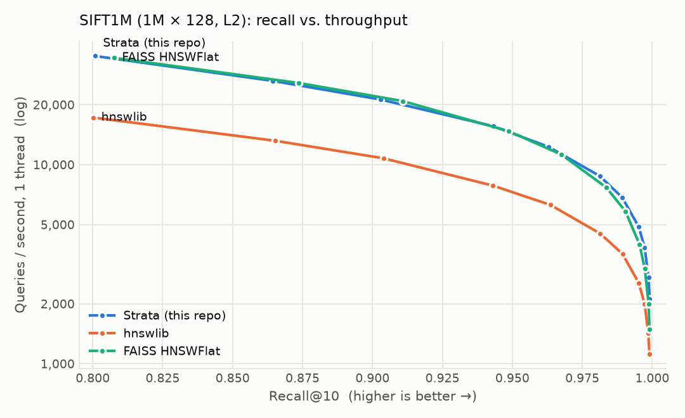
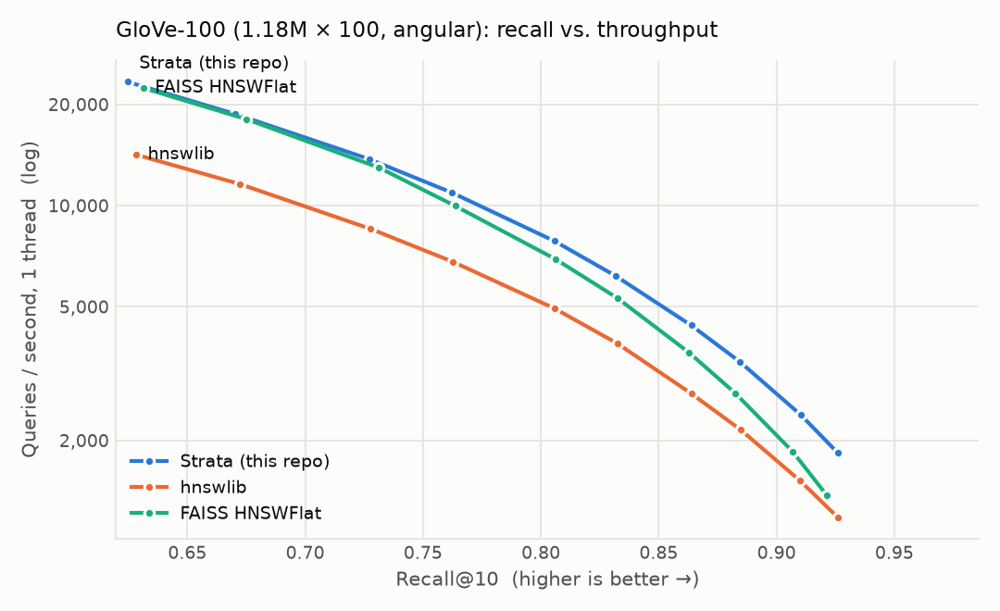
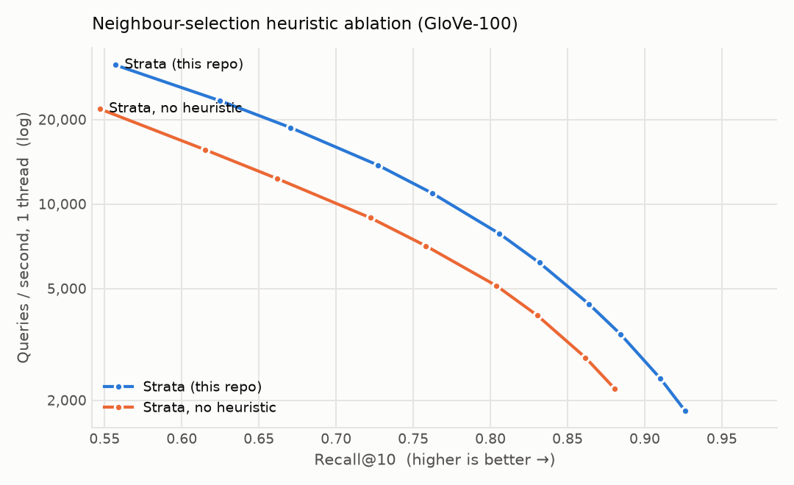
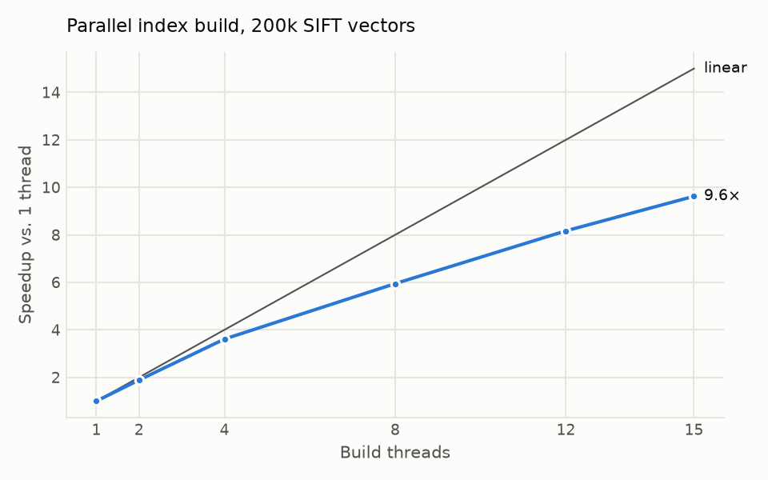
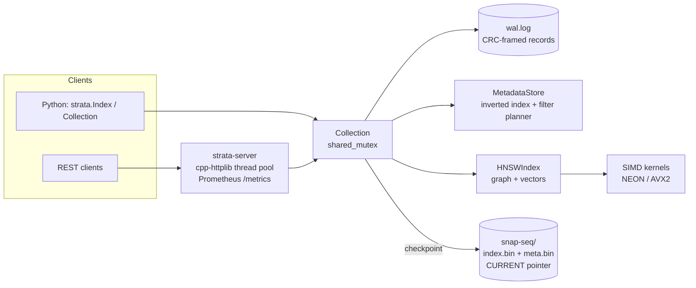

# Strata

**A vector database written from scratch in C++17.** It implements an HNSW index with NEON/AVX2 SIMD kernels,
parallel lock-light graph construction, metadata filtering, write-ahead-log durability, a REST server and
Python bindings. On 1M-vector benchmarks it matches FAISS and runs ~2× faster than hnswlib, at the same recall.

```
1M SIFT vectors · Apple M5 Pro
  build                 20.5 s on 15 threads (9.6× faster than 1 thread)
  query, recall 0.99    6,597 QPS on one core · 0.15 ms
  REST server           76,500 req/s, p99 2 ms (32 connections)
  crash safety          WAL + CRC-checked snapshots; tests kill it mid-write and recover
```

<picture>
  <source media="(prefers-color-scheme: dark)" srcset="docs/img/sift-recall-qps-dark.png">
  
</picture>

## Why this exists

Every RAG system and recommendation engine needs nearest-neighbour search over embeddings, and most people use
it as a black box. I built one end to end to understand the whole stack: the graph algorithm, the memory layout
and SIMD that make it fast, the concurrency that makes building it parallel, and the logging that makes it
durable. It also serves as the retrieval engine of my RAG project, [Evident](https://github.com/VividhDesign/evident).

## Features

| Area | What is implemented |
|---|---|
| Index | HNSW (Malkov & Yashunin) with the neighbour-selection heuristic; L2, inner product, cosine |
| Speed | NEON (ARM64) and AVX2+FMA (x86-64) distance kernels, cache-friendly node layout, software prefetch, pooled visited lists |
| Concurrency | Parallel inserts with 1-byte per-node spinlocks; lock-free concurrent reads; verified with ThreadSanitizer |
| Data ops | Upsert, delete (tombstones), compaction, exact brute-force `FlatIndex` |
| Filtering | Allow/deny id lists and Mongo-style metadata filters (`$eq $ne $in $nin $and $or`) with an inverted index; automatic brute-force fallback for very selective filters |
| Durability | Write-ahead log with CRC-32 records, atomic snapshots (`CURRENT` pointer + rename), crash recovery that tolerates torn writes, `F_FULLFSYNC` on macOS |
| Interfaces | C++ library · Python package (pybind11, zero-copy NumPy, GIL released) · HTTP/JSON server with Prometheus metrics |

Design write-up: **[docs/DESIGN.md](docs/DESIGN.md)**. It explains every decision above and its trade-offs.

## Quickstart

```bash
git clone https://github.com/VividhDesign/strata && cd strata
pip install .                      # builds the C++ extension (needs CMake ≥ 3.20 and a C++17 compiler)
# Docker / cloud images: build portable AVX2 code instead of tuning for the build machine
pip install . --config-settings=cmake.define.STRATA_NATIVE=OFF
```

```python
import numpy as np, strata

index = strata.Index(dim=384, metric="cosine", M=16, ef_construction=200)
index.add(np.random.rand(100_000, 384).astype("float32"))             # parallel build, ids 0..n-1
ids, distances = index.search(np.random.rand(5, 384).astype("float32"), k=10, ef=128)
index.search(queries, k=10, filter_ids=allowed_ids)                     # or exclude_ids=...
index.remove([3, 4]); index.compact(); index.save("index.bin")

# Durable collection with metadata filters (WAL + snapshots on disk)
col = strata.Collection.create("./my-collection", dim=384)
col.upsert(ids=[1, 2], vectors=vecs, metadata=[{"source": "wiki", "year": 2021}, {"source": "news", "year": 2024}])
col.query(query_vec, k=5, where={"source": "news", "year": {"$in": [2023, 2024]}})
```

### Server

```bash
cmake -S . -B build -G Ninja && cmake --build build      # also builds tests and benchmarks
./build/strata-server --data-dir ./data --port 8080
```

```bash
curl -X POST localhost:8080/collections -d '{"name": "docs", "dim": 3, "metric": "cosine"}'
curl -X POST localhost:8080/collections/docs/upsert \
     -d '{"ids": [1, 2], "vectors": [[1,0,0], [0,1,0]], "metadata": [{"lang": "en"}, {"lang": "hi"}]}'
curl -X POST localhost:8080/collections/docs/query -d '{"vector": [1,0.1,0], "k": 1, "filter": {"lang": "en"}}'
# {"results":[{"distance":0.00496286153793335,"id":1,"metadata":{"lang":"en"}}]}
```

Endpoints: `POST/GET /collections`, `GET/DELETE /collections/{name}`, `POST .../upsert | query | delete | checkpoint`,
`GET .../points/{id}`, `GET /health`, `GET /metrics`. A dependency-free Python client lives in `strata.client`.

## Benchmarks

All numbers below were measured on an **Apple M5 Pro (15 cores, 24 GB)** with the scripts in `bench/`.
The raw JSON is in `bench/results/`. All libraries use the same graph parameters (M=16, ef_construction=200).
Builds use all cores. Queries run on **one thread** (the ann-benchmarks convention) while sweeping `ef`, and
throughput is compared **at equal recall@10**.

### SIFT1M: 1,000,000 × 128, L2, 10,000 queries

| Library | Build (s) | Index (MiB) | QPS @ R≥0.90 | QPS @ R≥0.95 | QPS @ R≥0.99 | All-core QPS (ef=64) |
|---|---:|---:|---:|---:|---:|---:|
| **Strata** | **20.5** | 642 | 21,640 | 14,463 | **6,597** | **115,682** |
| FAISS `IndexHNSWFlat` 1.15 | 21.3 | 626 | 22,282 | 14,490 | 5,944 | 113,056 |
| hnswlib 0.8 | 38.5 | 630 | 11,015 | 7,320 | 3,452 | 54,568 |

### GloVe-100: 1,183,514 × 100, angular, 10,000 queries

| Library | Build (s) | Index (MiB) | QPS @ R≥0.70 | QPS @ R≥0.80 | QPS @ R≥0.90 | All-core QPS (ef=64) |
|---|---:|---:|---:|---:|---:|---:|
| **Strata** | **28.9** | 634 | **16,127** | **8,251** | **2,799** | **107,396** |
| FAISS `IndexHNSWFlat` 1.15 | 30.1 | 614 | 15,811 | 7,373 | 2,109 | 99,055 |
| hnswlib 0.8 | 52.5 | 619 | 10,057 | 5,192 | 1,769 | 61,072 |

<picture>
  <source media="(prefers-color-scheme: dark)" srcset="docs/img/glove-recall-qps-dark.png">
  
</picture>

**How to read this fairly:**

- At equal `ef`, Strata and hnswlib reach the **same recall**: 0.9630 vs 0.9636 on SIFT at ef=64. That is the
  check that Strata implements the same algorithm. The speed gap comes from engineering.
- Part of that gap is platform-specific. hnswlib's hand-written SIMD kernels are x86-only (SSE/AVX), so on
  Apple Silicon its distance loop runs scalar. On an x86 server I would expect the gap to hnswlib to shrink.
- FAISS ships NEON kernels, so the FAISS comparison is apples to apples: Strata is level at high QPS and
  11-33% ahead in the high-recall regime.

### Where the speed comes from

| Optimisation | Measured effect |
|---|---|
| NEON kernels with 4 independent accumulators | **10.9-15.0× faster** distance computation than the scalar loop (d = 128…1536; `bench/micro_distance.cpp`) |
| Neighbour-selection heuristic vs. plain "M closest" | **+10 points recall** at the same ef on GloVe (0.762 vs 0.662 at ef=64; see chart) |
| Parallel build with per-node spinlocks | **9.6×** on 15 threads (5 performance + 10 efficiency cores), recall unchanged at every thread count |
| Sorted posting lists for metadata filters | filtered queries through the server went from 3.5k → **10.8k req/s** |

<p>
<picture>
  <source media="(prefers-color-scheme: dark)" srcset="docs/img/ablation-heuristic-dark.png">
  
</picture>
<picture>
  <source media="(prefers-color-scheme: dark)" srcset="docs/img/build-scaling-dark.png">
  
</picture>
</p>

### HTTP server (200k SIFT vectors, ef=64, keep-alive)

| Load generator | Concurrency | Throughput | p50 | p99 |
|---|---:|---:|---:|---:|
| `ab` (single query) | 32 | **76,507 req/s** | <1 ms | 2 ms |
| Python client (2,000 distinct queries) | 1 | 7,942 req/s | 0.13 ms | 0.15 ms |
| Python client | 8 | 21,391 req/s | 0.32 ms | 1.02 ms |
| Python client, filter `{"shard": 3}` (10% selectivity) | 8 | 10,815 req/s | 0.72 ms | 1.19 ms |

Ingest over HTTP with JSON bodies runs at 34k vectors/s. The Python load generator saturates at about 21k req/s,
so `ab` shows the server's actual capacity.

Reproduce everything:

```bash
python bench/bench_ann.py --dataset sift        # downloads nothing: put ann-benchmarks HDF5 files in bench/data/
python bench/bench_ann.py --dataset glove
python bench/bench_ann.py --dataset glove --libs strata-noheuristic --tag ablation
python bench/bench_scaling.py && ./build/micro_distance
./build/strata-server --data-dir /tmp/s & python bench/load_test.py
python bench/plot.py && python bench/summarize.py
```

## Architecture



Write path: **WAL append → fsync → apply in memory → ack**. Recovery: **load the snapshot named by `CURRENT` →
replay WAL records newer than it → truncate any torn tail**. Full details in [docs/DESIGN.md](docs/DESIGN.md).

## Tests

```bash
cmake -S . -B build -G Ninja && cmake --build build && ./build/strata_tests   # 27 cases, 6,511 assertions
pip install ".[test]" && pytest                                                # 13 Python tests
cmake -S . -B build-tsan -DSTRATA_SANITIZE=thread && cmake --build build-tsan && ./build-tsan/strata_tests
cmake -S . -B build-asan -DSTRATA_SANITIZE=address && cmake --build build-asan && ./build-asan/strata_tests
```

The tests cover:
- recall against brute force for every metric;
- single- vs multi-threaded builds;
- upsert, delete and compaction semantics;
- allow/deny filters on both the graph path and the brute-force path;
- byte-for-byte save/load round trips, and rejection of flipped or truncated files;
- WAL replay with torn and corrupted tails;
- crash recovery of a collection from WAL only and from snapshot + WAL;
- auto-checkpointing.

The suite passes cleanly under **ThreadSanitizer** and **AddressSanitizer**.

## Project layout

```
include/strata/   public headers (hnsw.h, collection.h, distance.h, ...)
src/              index, kernels, I/O + CRC, WAL, metadata, collection
server/           REST server
python/           pybind11 bindings + Python package (Collection wrapper, HTTP client)
tests/            C++ (doctest) and Python (pytest) suites
bench/            benchmark, plotting and load-test scripts; results/ holds raw JSON
docs/DESIGN.md    how it works and why
```

## Limitations and next steps

- Writes block reads for the duration of a batch. The fix is segment-based storage: immutable HNSW segments plus
  a small mutable buffer.
- No vector compression yet. Product or scalar quantization would cut memory 4-32×.
- Single node. The WAL is the natural replication log for followers.

## License

MIT
